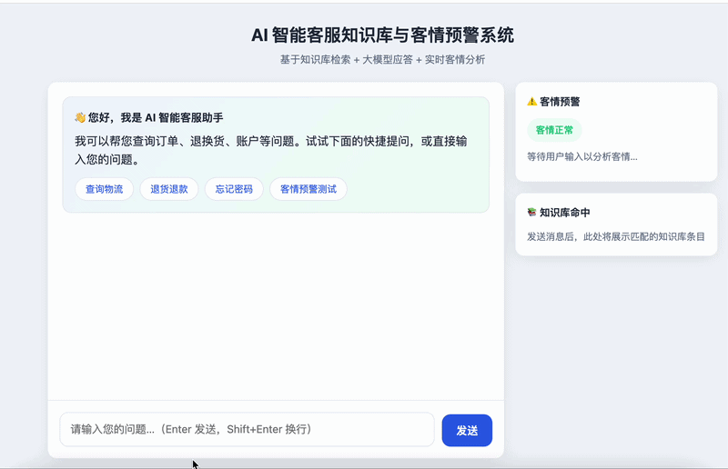

# 基于 DeepSeek 的 B端智能客服知识库与客情预警系统

本项目是一个轻量级、企业级的全栈 AI 应用。旨在解决 B 端企业在传统售后客服中“知识库维护成本高”以及“高危客情无法前置感知导致大客户流失”的业务痛点。

## 📺 系统演示

## 🚀 核心技术亮点
1. **真实大模型对接**：基于 Python Flask 框架，标准化对接 DeepSeek-Chat 商业级 API，实现高质量 AI 文本交互。
2. **轻量级动态 RAG**：后端开发本地文档动态挂载模块，自动读取 `knowledge/报价表.txt` 并作为上下文喂给大模型，实现零门槛文档智能化。
3. **客情风险实时拦截**：设计后端文本分词与情绪监控，秒级识别“投诉、退钱”等高危词汇，管理侧前端看板实时高亮触发“客情预警”。

## 🛠️ 项目文件结构
* app.py (后端核心逻辑)
* requirements.txt (项目依赖包)
* .env.example (安全隔离配置模板)
* knowledge/报价表.txt (企业业务报价数据)
* templates/index.html (客服交互与管理看板前端)

## 💻 本地快速开始
1. 克隆项目并安装依赖：
   git clone https://github.com/kaishui42/ai-customer-service-demo.git
   pip install -r requirements.txt
2. 配置 `.env` 文件并填入您的 `DEEPSEEK_API_KEY`。
3. 运行 `python app.py` 启动服务。
